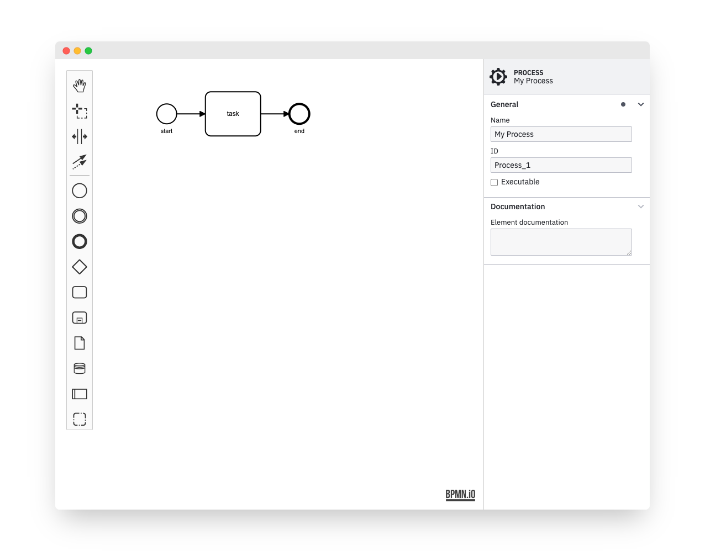

> Extending the properties panel changed significantly with `bpmn-js-properties-panel>=1`. For the `0.x` version of the library, check out [the 0.x branch](https://github.com/bpmn-io/bpmn-js-properties-panel/tree/0.x). Read more on the changes [in the changelog](https://github.com/bpmn-io/bpmn-js-properties-panel/blob/master/CHANGELOG.md#100-alpha0).

# bpmn-js-properties-panel

[](https://github.com/bpmn-io/bpmn-js-properties-panel/actions?query=workflow%3ACI)

A properties panel extension for [bpmn-js](https://github.com/bpmn-io/bpmn-js) that adds the ability to edit technical properties (generic and [Camunda](https://camunda.com)).

[](https://github.com/bpmn-io/bpmn-js-examples/tree/master/properties-panel)


## Features

The properties panel allows users to edit invisible BPMN properties in a convenient way.

Some of the features are:

* Edit element ids, multi-instance details and more
* Edit execution related [Camunda 7](https://docs.camunda.org) and [Camunda 8](https://docs.camunda.io/) properties
* Redo and undo (plugs into the [bpmn-js](https://github.com/bpmn-io/bpmn-js) editing cycle)

## Usage

Provide two HTML elements, one for the properties panel and one for the BPMN diagram:

```html
<div class="modeler">
  <div id="canvas"></div>
  <div id="properties"></div>
</div>
```

Bootstrap [bpmn-js](https://github.com/bpmn-io/bpmn-js) with the properties panel and a [properties provider](https://github.com/bpmn-io/bpmn-js-properties-panel/tree/master/src/provider):


```javascript
import BpmnModeler from 'bpmn-js/lib/Modeler';
import {
  BpmnPropertiesPanelModule,
  BpmnPropertiesProviderModule,
} from 'bpmn-js-properties-panel';

const modeler = new BpmnModeler({
  container: '#canvas',
  propertiesPanel: {
    parent: '#properties'
  },
  additionalModules: [
    BpmnPropertiesPanelModule,
    BpmnPropertiesProviderModule
  ]
});
```

### Styling

For proper styling include the necessary stylesheets:

```html
<link rel="stylesheet" href="https://unpkg.com/bpmn-js-properties-panel/dist/assets/properties-panel.css">
```


### Dynamic Attach/Detach

You may attach or detach the properties panel dynamically to any element on the page, too:

```javascript
const propertiesPanel = bpmnJS.get('propertiesPanel');

// detach the panel
propertiesPanel.detach();

// attach it to some other element
propertiesPanel.attachTo('#other-properties');
```


### Use with Camunda properties

In order to be able to edit [Camunda](https://camunda.com) related properties, use the [camunda platform properties provider](https://github.com/bpmn-io/bpmn-js-properties-panel/tree/master/src/provider/camunda-platform).
In addition, you need to define the `camunda` namespace via [camunda-bpmn-moddle](https://github.com/camunda/camunda-bpmn-moddle).

```javascript
import BpmnModeler from 'bpmn-js/lib/Modeler';
import {
  BpmnPropertiesPanelModule,
  BpmnPropertiesProviderModule,
  
  // use Camunda Platform properties provider
  CamundaPlatformPropertiesProviderModule
} from 'bpmn-js-properties-panel';

// use Camunda BPMN Moddle extension
import CamundaExtensionModule from 'camunda-bpmn-moddle/lib';

// use Camunda BPMN namespace
import camundaModdleDescriptors from 'camunda-bpmn-moddle/resources/camunda';

const modeler = new BpmnModeler({
  container: '#canvas',
  propertiesPanel: {
    parent: '#properties'
  },
  additionalModules: [
    BpmnPropertiesPanelModule,
    BpmnPropertiesProviderModule,
    CamundaPlatformPropertiesProviderModule,
    CamundaExtensionModule
  ],
  moddleExtensions: {
    camunda: camundaModdleDescriptors
  }
});
...
```

### API

#### `BpmnPropertiesPanelRenderer#attachTo(container: HTMLElement) => void`

Attach the properties panel to a parent node.

```javascript
const propertiesPanel = modeler.get('propertiesPanel');

propertiesPanel.attachTo('#other-properties');
```

#### `BpmnPropertiesPanelRenderer#detach() => void`

Detach the properties panel from its parent node.

```javascript
const propertiesPanel = modeler.get('propertiesPanel');

propertiesPanel.detach();
```

#### `BpmnPropertiesPanelRenderer#registerProvider(priority: Number, provider: PropertiesProvider) => void`

Register a new properties provider to the properties panel.

```javascript
class ExamplePropertiesProvider {
  constructor(propertiesPanel) {
    propertiesPanel.registerProvider(500, this);
  }

  getGroups(element) {
    return (groups) => {

      // add, modify or remove groups
      // ...

      return groups;
    };
  }
}

ExamplePropertiesProvider.$inject = [ 'propertiesPanel' ];
```

## Additional Resources

* [Issue tracker](https://github.com/bpmn-io/bpmn-js-properties-panel)
* [Forum](https://forum.bpmn.io)
* [Example Project](https://github.com/bpmn-io/bpmn-js-examples/tree/master/properties-panel)


## Development

Prepare the project by installing all dependencies:

```sh
npm install
```

Then, depending on your use-case, you may run any of the following commands:

```sh
# build the library and run all tests
npm run all

# spin up a single local modeler instance
npm start

# run the full development setup
npm run dev
```

## License

MIT
